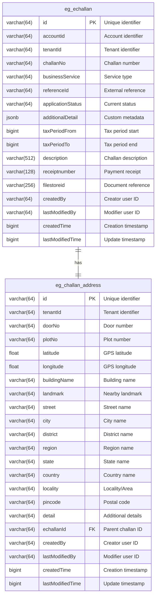

# E-Challan Database Schema Documentation

## Overview
This document describes the database schema for the E-Challan management system. The schema consists of two main tables that manage electronic challans (e-challans) and their associated address information.

---

## Entity Relationship Diagram



### ER Diagram

```
┌─────────────────────────────────────────────────────────┐
│                    eg_echallan                          │
├─────────────────────────────────────────────────────────┤
│ PK  id                    VARCHAR(64)                   │
│     accountid             VARCHAR(64)                   │
│     tenantId              VARCHAR(64)                   │
│     challanNo             VARCHAR(64)                   │
│     businessService       VARCHAR(64)                   │
│     referenceId           VARCHAR(64)                   │
│     applicationStatus     VARCHAR(64)                   │
│     additionalDetail      JSONB                         │
│     taxPeriodFrom         BIGINT                        │
│     taxPeriodTo           BIGINT                        │
│     description           VARCHAR(512)                  │
│     receiptnumber         VARCHAR(128)                  │
│     filestoreid           VARCHAR(256)                  │
│     createdBy             VARCHAR(64)                   │
│     lastModifiedBy        VARCHAR(64)                   │
│     createdTime           BIGINT                        │
│     lastModifiedTime      BIGINT                        │
└─────────────────────────────────────────────────────────┘
                            │
                            │ 1
                            │
                            │ has
                            │
                            │ 1
                            ▼
┌─────────────────────────────────────────────────────────┐
│                 eg_challan_address                      │
├─────────────────────────────────────────────────────────┤
│ PK  id                    VARCHAR(64)                   │
│     tenantId              VARCHAR(64)                   │
│     doorNo                VARCHAR(64)                   │
│     plotNo                VARCHAR(64)                   │
│     latitude              FLOAT                         │
│     longitude             FLOAT                         │
│     buildingName          VARCHAR(64)                   │
│     landmark              VARCHAR(64)                   │
│     street                VARCHAR(64)                   │
│     city                  VARCHAR(64)                   │
│     district              VARCHAR(64)                   │
│     region                VARCHAR(64)                   │
│     state                 VARCHAR(64)                   │
│     country               VARCHAR(64)                   │
│     locality              VARCHAR(64)                   │
│     pincode               VARCHAR(64)                   │
│     detail                VARCHAR(64)                   │
│ FK  echallanId            VARCHAR(64)                   │
│     createdBy             VARCHAR(64)                   │
│     lastModifiedBy        VARCHAR(64)                   │
│     createdTime           BIGINT                        │
│     lastModifiedTime      BIGINT                        │
└─────────────────────────────────────────────────────────┘

Legend:
  PK = Primary Key
  FK = Foreign Key
  Relationship: ONE eg_echallan to ONE eg_challan_address
  Constraint: ON DELETE CASCADE, ON UPDATE CASCADE
```

---

## Tables

### 1. eg_echallan
Main table for storing e-challan records.

| Column Name | Data Type | Size | Description | Metadata |
|------------|-----------|------|-------------|----------|
| **id** | VARCHAR | 64 | Unique identifier for the e-challan record | Primary key, unique constraint |
| accountid | VARCHAR | 64 | Account identifier associated with the challan | Links to user/account system |
| tenantId | VARCHAR | 64 | Tenant identifier for multi-tenancy support | Used for data isolation across different municipalities/organizations |
| challanNo | VARCHAR | 64 | Human-readable challan number | Displayed to users as reference number |
| businessService | VARCHAR | 64 | Type of business service for the challan | E.g., Property Tax, Water Charges, Trade License, etc. |
| referenceId | VARCHAR | 64 | Reference to external entity or transaction | Links to related service application/transaction |
| applicationStatus | VARCHAR | 64 | Current status of the challan | Values: ACTIVE, PAID, CANCELLED, EXPIRED, etc. |
| additionalDetail | JSONB | - | Flexible JSON field for storing additional metadata | Stores custom fields, configuration, or service-specific data |
| taxPeriodFrom | BIGINT | - | Start timestamp of the tax period | Unix timestamp (milliseconds) |
| taxPeriodTo | BIGINT | - | End timestamp of the tax period | Unix timestamp (milliseconds) |
| description | VARCHAR | 512 | Description of the challan | Added in migration V20201005114010, provides detailed information about the challan purpose |
| receiptnumber | VARCHAR | 128 | Receipt number after payment | Added in migration V20220204164010, stores payment receipt reference |
| filestoreid | VARCHAR | 256 | File store identifier for associated documents | Added in migration V20201001140430, links to document management system |
| createdBy | VARCHAR | 64 | User ID who created the record | Audit field for tracking record creation |
| lastModifiedBy | VARCHAR | 64 | User ID who last modified the record | Audit field for tracking record updates |
| createdTime | BIGINT | - | Timestamp when record was created | Unix timestamp (milliseconds) |
| lastModifiedTime | BIGINT | - | Timestamp when record was last modified | Unix timestamp (milliseconds) |

**Constraints:**
- UNIQUE constraint on `id` column

**Indexes Recommendation:**
- Index on `challanNo` for quick lookup
- Index on `accountid` for user queries
- Index on `tenantId` for multi-tenant filtering
- Index on `applicationStatus` for status-based queries
- Composite index on `(tenantId, applicationStatus)` for common queries

---

### 2. eg_challan_address
Table for storing address information associated with e-challans.

| Column Name | Data Type | Size | Description | Metadata |
|------------|-----------|------|-------------|----------|
| **id** | VARCHAR | 64 | Unique identifier for the address record | Primary key |
| tenantId | VARCHAR | 64 | Tenant identifier for multi-tenancy support | Matches tenant in parent challan |
| doorNo | VARCHAR | 64 | Door/house number | Part of physical address |
| plotNo | VARCHAR | 64 | Plot number | Land/property plot identifier |
| latitude | FLOAT | - | Geographical latitude coordinate | GPS coordinate for location mapping |
| longitude | FLOAT | - | Geographical longitude coordinate | GPS coordinate for location mapping |
| buildingName | VARCHAR | 64 | Name of the building | Commercial/residential building identifier |
| landmark | VARCHAR | 64 | Nearby landmark for reference | Helps in location identification |
| street | VARCHAR | 64 | Street name | Part of physical address |
| city | VARCHAR | 64 | City name | Administrative division |
| district | VARCHAR | 64 | District name | Administrative division |
| region | VARCHAR | 64 | Region name | Administrative division |
| state | VARCHAR | 64 | State name | Administrative division |
| country | VARCHAR | 64 | Country name | Administrative division |
| locality | VARCHAR | 64 | Locality or area name | Neighborhood/zone identifier |
| pincode | VARCHAR | 64 | Postal code | Postal/ZIP code |
| detail | VARCHAR | 64 | Additional address details | Supplementary address information |
| **echallanId** | VARCHAR | 64 | Foreign key reference to eg_echallan | Links address to parent challan record |
| createdBy | VARCHAR | 64 | User ID who created the record | Audit field for tracking record creation |
| lastModifiedBy | VARCHAR | 64 | User ID who last modified the record | Audit field for tracking record updates |
| createdTime | BIGINT | - | Timestamp when record was created | Unix timestamp (milliseconds) |
| lastModifiedTime | BIGINT | - | Timestamp when record was last modified | Unix timestamp (milliseconds) |

**Constraints:**
- PRIMARY KEY on `id` column
- FOREIGN KEY on `echallanId` references `eg_echallan(id)`
  - ON UPDATE CASCADE: Updates propagate to child records
  - ON DELETE CASCADE: Deleting a challan deletes associated addresses

**Indexes Recommendation:**
- Index on `echallanId` for join operations
- Index on `pincode` for location-based queries
- Composite index on `(city, locality)` for area-based searches
- Spatial index on `(latitude, longitude)` for geo-queries


