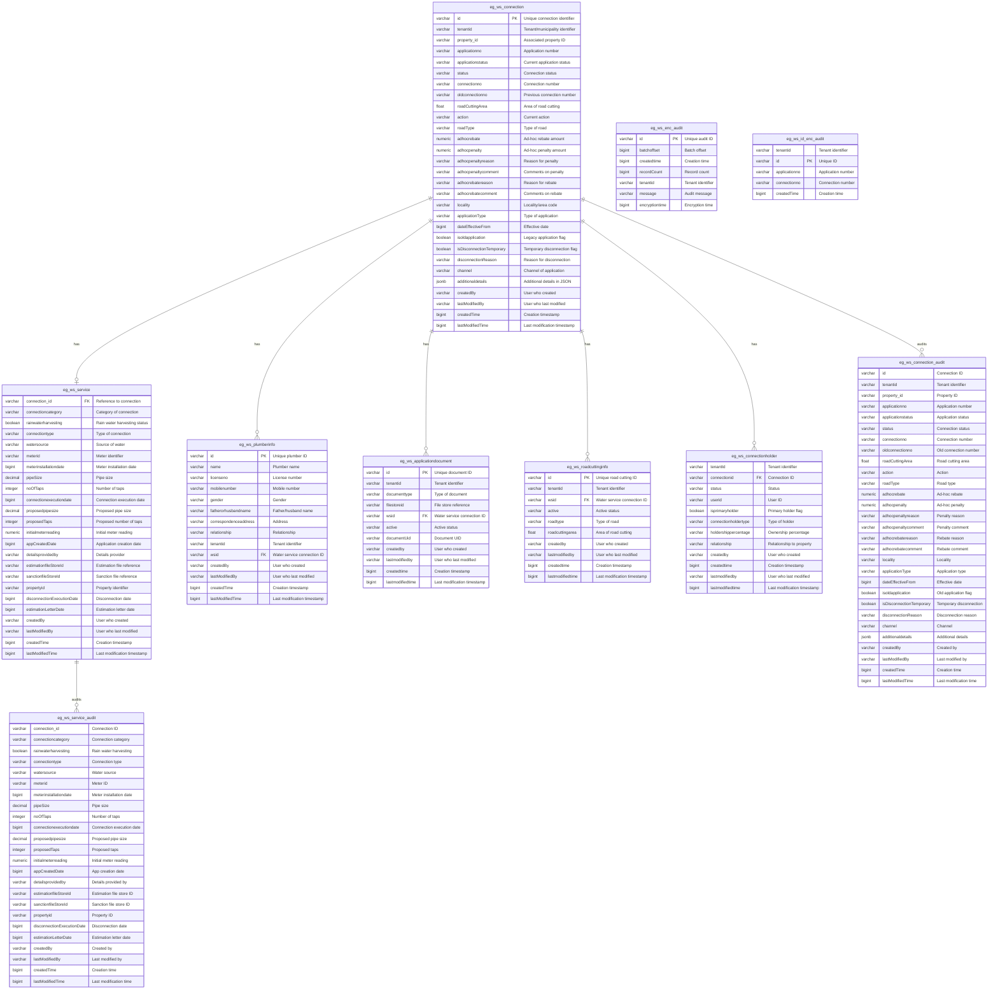

# Water Service Database Schema Documentation

## Overview
This database schema manages water service connections for urban municipalities. It tracks applications, service details, plumber information, connection holders, road cutting information, and maintains comprehensive audit trails.


## Entity Relationship Diagram

```
┌──────────────────────────────────────────────────────────────────────────────────────┐
│                             WATER SERVICE DATABASE SCHEMA                             │
└──────────────────────────────────────────────────────────────────────────────────────┘


┌─────────────────────────────────┐
│    eg_ws_connection (MAIN)      │
│─────────────────────────────────│
│ PK: id                          │
│ • tenantid                      │
│ • property_id                   │
│ • applicationno                 │
│ • applicationstatus             │
│ • status                        │
│ • connectionno                  │
│ • oldconnectionno               │
│ • locality                      │
│ • applicationType               │
│ • channel                       │
│ • additionaldetails (JSONB)     │
│ • disconnectionReason           │
│ • adhocrebate, adhocpenalty     │
│ • createdBy, createdTime        │
│ • (25 columns total)            │
└─────────────────────────────────┘
         │
         │ 1:1
         ├──────────────────────────────────────────────────────┐
         │                                                       │
         │ 1:N                                                   ▼
         ├─────────────────────────────────┐      ┌──────────────────────────────┐
         │                                 │      │    eg_ws_service             │
         │                                 │      │──────────────────────────────│
         │                                 │      │ FK: connection_id            │
         │                                 │      │ • connectioncategory         │
         │                                 │      │ • rainwaterharvesting        │
         │                                 │      │ • connectiontype             │
         │                                 │      │ • watersource                │
         │                                 │      │ • meterid                    │
         │                                 │      │ • pipeSize, noOfTaps         │
         │                                 │      │ • meterinstallationdate      │
         │                                 │      │ • connectionexecutiondate    │
         │                                 │      │ • disconnectionExecutionDate │
         │                                 │      │ • propertyid                 │
         │                                 │      │ • (21 columns total)         │
         │                                 │      └──────────────────────────────┘
         │                                 │                  │
         │                                 │                  │ 1:N
         │                                 │                  ▼
         │                                 │      ┌──────────────────────────────┐
         │                                 │      │  eg_ws_service_audit         │
         │                                 │      │──────────────────────────────│
         │                                 │      │ (Audit Trail - All Changes)  │
         │                                 │      └──────────────────────────────┘
         │                                 │
         │                                 ▼
         │              ┌──────────────────────────────┐
         │              │  eg_ws_plumberinfo           │
         │              │──────────────────────────────│
         │              │ PK: id                       │
         │              │ FK: wsid                     │
         │              │ • name                       │
         │              │ • licenseno                  │
         │              │ • mobilenumber               │
         │              │ • gender                     │
         │              │ • correspondenceaddress      │
         │              │ • (14 columns total)         │
         │              └──────────────────────────────┘
         │
         │ 1:N
         ├──────────────────────────────────────────┐
         │                                           │
         ▼                                           ▼
┌──────────────────────────────┐     ┌──────────────────────────────┐
│ eg_ws_applicationdocument    │     │  eg_ws_roadcuttinginfo       │
│──────────────────────────────│     │──────────────────────────────│
│ PK: id                       │     │ PK: id                       │
│ FK: wsid                     │     │ FK: wsid                     │
│ • documenttype               │     │ • roadtype                   │
│ • filestoreid                │     │ • roadcuttingarea            │
│ • documentUid                │     │ • active                     │
│ • active                     │     │ • tenantid                   │
│ • (11 columns total)         │     │ • (10 columns total)         │
└──────────────────────────────┘     └──────────────────────────────┘

         │ 1:N
         │
         ▼
┌──────────────────────────────┐
│  eg_ws_connectionholder      │
│──────────────────────────────│
│ FK: connectionid (UNIQUE)    │
│ • userid                     │
│ • isprimaryholder            │
│ • connectionholdertype       │
│ • holdershippercentage       │
│ • relationship               │
│ • status                     │
│ • (12 columns total)         │
└──────────────────────────────┘

         │ 1:N
         │
         ▼
┌─────────────────────────────────┐
│  eg_ws_connection_audit         │
│─────────────────────────────────│
│ (Audit Trail - All Changes)     │
│ • Captures complete snapshot    │
│ • No PK (allows multiple vers.) │
│ • Same 25 columns as main table │
└─────────────────────────────────┘


┌──────────────────────────────┐     ┌──────────────────────────────┐
│    ENCRYPTION AUDIT TABLES   │     │                              │
│──────────────────────────────│     │                              │
│  eg_ws_enc_audit             │     │  eg_ws_id_enc_audit          │
│──────────────────────────────│     │──────────────────────────────│
│ PK: id                       │     │ PK: id                       │
│ • batchoffset                │     │ • tenantid                   │
│ • recordCount                │     │ • applicationno              │
│ • encryptiontime             │     │ • connectionno               │
│ • message                    │     │ • createdTime                │
│ • (7 columns total)          │     │ • (5 columns total)          │
└──────────────────────────────┘     └──────────────────────────────┘


LEGEND:
═══════
PK  = Primary Key
FK  = Foreign Key
1:1 = One-to-One Relationship
1:N = One-to-Many Relationship
CASCADE = ON DELETE/UPDATE CASCADE enabled
```

---

## Entity Relationship Diagram



---

## Detailed Table Descriptions

### 1. eg_ws_connection (Main Connection Table)
**Purpose**: Core table storing water service connection information and application details.

| Column Name | Data Type | Constraints | Description |
|-------------|-----------|-------------|-------------|
| id | VARCHAR(64) | PRIMARY KEY | Unique identifier for each water connection |
| tenantid | VARCHAR(250) | NOT NULL, INDEXED | Municipality/tenant identifier for multi-tenancy |
| property_id | VARCHAR(64) | NOT NULL, INDEXED | Reference to the property receiving water service |
| applicationno | VARCHAR(64) | INDEXED | Unique application number for tracking |
| applicationstatus | VARCHAR(256) | INDEXED | Current status of application (PENDING, APPROVED, REJECTED, etc.) |
| status | VARCHAR(64) | NOT NULL | Connection status (ACTIVE, INACTIVE, DISCONNECTED) |
| connectionno | VARCHAR(256) | INDEXED | Unique connection number assigned after approval |
| oldconnectionno | VARCHAR(64) | INDEXED | Previous connection number if migrated from legacy system |
| roadCuttingArea | FLOAT | | Area (in sq meters) of road to be cut for pipe laying |
| action | VARCHAR(64) | | Current workflow action |
| roadType | VARCHAR(32) | | Type of road where cutting is required (PAVED, UNPAVED) |
| adhocrebate | NUMERIC(12,2) | | Ad-hoc rebate amount in currency |
| adhocpenalty | NUMERIC(12,2) | | Ad-hoc penalty amount in currency |
| adhocpenaltyreason | VARCHAR(1024) | | Reason for applying penalty |
| adhocpenaltycomment | VARCHAR(1024) | | Additional comments on penalty |
| adhocrebatereason | VARCHAR(1024) | | Reason for providing rebate |
| adhocrebatecomment | VARCHAR(1024) | | Additional comments on rebate |
| locality | VARCHAR(64) | | Locality/ward code for geographic grouping |
| applicationType | VARCHAR(64) | | Type of application (NEW, MODIFY, DISCONNECT) |
| dateEffectiveFrom | BIGINT | | Effective date from which changes apply (epoch timestamp) |
| isoldapplication | BOOLEAN | DEFAULT FALSE | Flag indicating legacy/migrated application |
| isDisconnectionTemporary | BOOLEAN | DEFAULT FALSE | Flag for temporary disconnections |
| disconnectionReason | VARCHAR(1024) | | Reason for disconnection if applicable |
| channel | VARCHAR(128) | | Channel through which application was created (SYSTEM, CITIZEN, COUNTER) |
| additionaldetails | JSONB | | Flexible JSON field for additional metadata |
| createdBy | VARCHAR(64) | | User ID who created the record |
| lastModifiedBy | VARCHAR(64) | | User ID who last modified the record |
| createdTime | BIGINT | | Creation timestamp (epoch milliseconds) |
| lastModifiedTime | BIGINT | | Last modification timestamp (epoch milliseconds) |

**Indexes**:
- index_eg_ws_connection_tenantId
- index_eg_ws_connection_applicationNo
- index_eg_ws_connection_connectionNo
- index_eg_ws_connection_oldConnectionNo
- index_eg_ws_connection_property_id
- index_eg_ws_connection_applicationstatus

---

### 2. eg_ws_service (Service Details Table)
**Purpose**: Stores technical details about the water service configuration and meter information.

| Column Name | Data Type | Constraints | Description |
|-------------|-----------|-------------|-------------|
| connection_id | VARCHAR(64) | FOREIGN KEY (eg_ws_connection.id), CASCADE DELETE/UPDATE | Reference to parent connection |
| connectioncategory | VARCHAR(32) | | Category of connection (RESIDENTIAL, COMMERCIAL, INDUSTRIAL) |
| rainwaterharvesting | BOOLEAN | | Indicates if property has rainwater harvesting |
| connectiontype | VARCHAR(32) | | Type of connection (METERED, NON_METERED) |
| watersource | VARCHAR(64) | | Source of water supply |
| meterid | VARCHAR(64) | | Unique meter identifier |
| meterinstallationdate | BIGINT | | Date when meter was installed (epoch timestamp) |
| pipeSize | DECIMAL | | Actual pipe diameter in millimeters |
| noOfTaps | INTEGER | | Actual number of taps installed |
| connectionexecutiondate | BIGINT | | Date when connection was physically executed (epoch timestamp) |
| proposedpipesize | DECIMAL | | Proposed pipe size during application |
| proposedTaps | INTEGER | | Proposed number of taps during application |
| initialmeterreading | NUMERIC(12,3) | | Initial reading of meter at installation |
| appCreatedDate | BIGINT | INDEXED | Application creation date (epoch timestamp) |
| detailsprovidedby | VARCHAR(256) | | Who provided the service details |
| estimationfileStoreId | VARCHAR(256) | | Reference to estimation document in file store |
| sanctionfileStoreId | VARCHAR(256) | | Reference to sanction document in file store |
| propertyid | VARCHAR(64) | | Property identifier |
| disconnectionExecutionDate | BIGINT | | Date when disconnection was executed (epoch timestamp) |
| estimationLetterDate | BIGINT | | Date of estimation letter (epoch timestamp) |
| createdBy | VARCHAR(64) | | User ID who created the record |
| lastModifiedBy | VARCHAR(64) | | User ID who last modified the record |
| createdTime | BIGINT | | Creation timestamp (epoch milliseconds) |
| lastModifiedTime | BIGINT | | Last modification timestamp (epoch milliseconds) |

**Indexes**:
- index_eg_ws_service_appCreatedDate

---

### 3. eg_ws_plumberinfo (Plumber Information Table)
**Purpose**: Stores licensed plumber details who performed the installation work.

| Column Name | Data Type | Constraints | Description |
|-------------|-----------|-------------|-------------|
| id | VARCHAR(256) | PRIMARY KEY | Unique plumber information record ID |
| name | VARCHAR(256) | | Full name of the plumber |
| licenseno | VARCHAR(256) | | Government-issued plumber license number |
| mobilenumber | VARCHAR(256) | | Contact mobile number |
| gender | VARCHAR(256) | | Gender of plumber |
| fatherorhusbandname | VARCHAR(256) | | Father's or husband's name |
| correspondenceaddress | VARCHAR(1024) | | Full correspondence address |
| relationship | VARCHAR(256) | | Relationship type (FATHER, HUSBAND) |
| tenantid | VARCHAR(64) | | Tenant identifier |
| wsid | VARCHAR(64) | FOREIGN KEY (eg_ws_connection.id), CASCADE DELETE/UPDATE | Reference to water connection |
| createdBy | VARCHAR(64) | | User ID who created the record |
| lastModifiedBy | VARCHAR(64) | | User ID who last modified the record |
| createdTime | BIGINT | | Creation timestamp (epoch milliseconds) |
| lastModifiedTime | BIGINT | | Last modification timestamp (epoch milliseconds) |

---

### 4. eg_ws_applicationdocument (Application Documents Table)
**Purpose**: Stores references to documents uploaded as part of the application.

| Column Name | Data Type | Constraints | Description |
|-------------|-----------|-------------|-------------|
| id | VARCHAR(64) | PRIMARY KEY | Unique document record ID |
| tenantid | VARCHAR(64) | | Tenant identifier |
| documenttype | VARCHAR(64) | | Type of document (OWNERSHIP_PROOF, ID_PROOF, etc.) |
| filestoreid | VARCHAR(64) | | Reference to file in file storage system |
| wsid | VARCHAR(64) | FOREIGN KEY (eg_ws_connection.id) | Reference to water connection |
| active | VARCHAR(64) | | Active status of document |
| documentUid | VARCHAR(64) | | Unique document identifier |
| createdby | VARCHAR(64) | | User ID who created the record |
| lastmodifiedby | VARCHAR(64) | | User ID who last modified the record |
| createdtime | BIGINT | | Creation timestamp (epoch milliseconds) |
| lastmodifiedtime | BIGINT | | Last modification timestamp (epoch milliseconds) |

---

### 5. eg_ws_roadcuttinginfo (Road Cutting Information Table)
**Purpose**: Tracks details about road cutting required for pipe installation.

| Column Name | Data Type | Constraints | Description |
|-------------|-----------|-------------|-------------|
| id | VARCHAR(64) | PRIMARY KEY | Unique road cutting record ID |
| tenantid | VARCHAR(64) | | Tenant identifier |
| wsid | VARCHAR(64) | FOREIGN KEY (eg_ws_connection.id), CASCADE DELETE/UPDATE | Reference to water connection |
| active | VARCHAR(64) | | Active status |
| roadtype | VARCHAR(32) | | Type of road (PAVED, UNPAVED, NATIONAL_HIGHWAY) |
| roadcuttingarea | FLOAT | | Area of road cutting in square meters |
| createdby | VARCHAR(64) | | User ID who created the record |
| lastmodifiedby | VARCHAR(64) | | User ID who last modified the record |
| createdtime | BIGINT | | Creation timestamp (epoch milliseconds) |
| lastmodifiedtime | BIGINT | | Last modification timestamp (epoch milliseconds) |

---

### 6. eg_ws_connectionholder (Connection Holder Table)
**Purpose**: Stores information about connection holders/owners (supports multiple owners).

| Column Name | Data Type | Constraints | Description |
|-------------|-----------|-------------|-------------|
| tenantId | VARCHAR(256) | | Tenant identifier |
| connectionid | VARCHAR(128) | FOREIGN KEY (eg_ws_connection.id), UNIQUE | Reference to water connection |
| status | VARCHAR(128) | | Status of connection holder |
| userid | VARCHAR(128) | INDEXED | User ID of the connection holder |
| isprimaryholder | BOOLEAN | | Flag indicating primary/secondary holder |
| connectionholdertype | VARCHAR(256) | | Type of holder (OWNER, TENANT) |
| holdershippercentage | VARCHAR(128) | | Percentage of ownership |
| relationship | VARCHAR(128) | | Relationship to property |
| createdby | VARCHAR(128) | | User ID who created the record |
| createdtime | BIGINT | | Creation timestamp (epoch milliseconds) |
| lastmodifiedby | VARCHAR(128) | | User ID who last modified the record |
| lastmodifiedtime | BIGINT | | Last modification timestamp (epoch milliseconds) |

**Indexes**:
- index_eg_ws_connectionholder_userid

---

### 7. eg_ws_connection_audit (Connection Audit Table)
**Purpose**: Maintains audit trail of all changes to connection records for compliance and tracking.

**Created in**: V202006020800__ws_alter_ddl.sql

| Column Name | Data Type | Constraints | Description |
|-------------|-----------|-------------|-------------|
| id | VARCHAR(64) | NOT NULL | Connection identifier (NOT a primary key) |
| tenantid | VARCHAR(250) | NOT NULL, INDEXED | Municipality/tenant identifier |
| property_id | VARCHAR(64) | NOT NULL, INDEXED | Reference to property |
| applicationno | VARCHAR(64) | INDEXED | Application number |
| applicationstatus | VARCHAR(256) | INDEXED | Application status at time of audit |
| status | VARCHAR(64) | NOT NULL | Connection status at time of audit |
| connectionno | VARCHAR(256) | INDEXED | Connection number |
| oldconnectionno | VARCHAR(64) | INDEXED | Previous connection number |
| roadCuttingArea | FLOAT | | Area of road cutting |
| action | VARCHAR(64) | | Workflow action |
| roadType | VARCHAR(32) | | Type of road |
| adhocrebate | NUMERIC(12,2) | | Ad-hoc rebate amount |
| adhocpenalty | NUMERIC(12,2) | | Ad-hoc penalty amount |
| adhocpenaltyreason | VARCHAR(1024) | | Reason for penalty |
| adhocpenaltycomment | VARCHAR(1024) | | Comments on penalty |
| adhocrebatereason | VARCHAR(1024) | | Reason for rebate |
| adhocrebatecomment | VARCHAR(1024) | | Comments on rebate |
| locality | VARCHAR(64) | | Locality/ward code |
| applicationType | VARCHAR(64) | | Type of application |
| dateEffectiveFrom | BIGINT | | Effective date |
| isoldapplication | BOOLEAN | | Legacy application flag |
| isDisconnectionTemporary | BOOLEAN | | Temporary disconnection flag |
| disconnectionReason | VARCHAR(1024) | | Reason for disconnection |
| channel | VARCHAR(128) | | Channel of application |
| additionaldetails | JSONB | | Additional metadata |
| createdBy | VARCHAR(64) | | User who created the record |
| lastModifiedBy | VARCHAR(64) | | User who last modified |
| createdTime | BIGINT | | Creation timestamp |
| lastModifiedTime | BIGINT | | Last modification timestamp |

**Key Characteristics**:
- No primary key (allows multiple audit versions for same connection)
- Captures complete state snapshot on each change
- Same indexes as main table for query performance
- Total 25 columns matching the main connection table

**Indexes**:
- index_eg_ws_connection_audit_tenantId
- index_eg_ws_connection_audit_applicationNo
- index_eg_ws_connection_audit_connectionNo
- index_eg_ws_connection_audit_oldConnectionNo
- index_eg_ws_connection_audit_property_id
- index_eg_ws_connection_audit_applicationstatus

---

### 8. eg_ws_service_audit (Service Audit Table)
**Purpose**: Maintains audit trail of all changes to service records.

**Created in**: V202006020800__ws_alter_ddl.sql

| Column Name | Data Type | Constraints | Description |
|-------------|-----------|-------------|-------------|
| connection_id | VARCHAR(64) | NOT NULL | Connection identifier (NOT a foreign key in audit) |
| connectioncategory | VARCHAR(32) | | Category of connection |
| rainwaterharvesting | BOOLEAN | | Rain water harvesting status |
| connectiontype | VARCHAR(32) | | Type of connection |
| watersource | VARCHAR(64) | | Source of water |
| meterid | VARCHAR(64) | | Meter identifier |
| meterinstallationdate | BIGINT | | Meter installation date |
| pipeSize | DECIMAL | | Pipe diameter |
| noOfTaps | INTEGER | | Number of taps |
| connectionexecutiondate | BIGINT | | Connection execution date |
| proposedpipesize | DECIMAL | | Proposed pipe size |
| proposedTaps | INTEGER | | Proposed number of taps |
| initialmeterreading | NUMERIC(12,3) | | Initial meter reading |
| appCreatedDate | BIGINT | INDEXED | Application creation date |
| detailsprovidedby | VARCHAR(256) | | Details provider |
| estimationfileStoreId | VARCHAR(256) | | Estimation file reference |
| sanctionfileStoreId | VARCHAR(256) | | Sanction file reference |
| propertyid | VARCHAR(64) | | Property identifier |
| disconnectionExecutionDate | BIGINT | | Disconnection date |
| createdBy | VARCHAR(64) | | User who created the record |
| lastModifiedBy | VARCHAR(64) | | User who last modified |
| createdTime | BIGINT | | Creation timestamp |
| lastModifiedTime | BIGINT | | Last modification timestamp |
| estimationLetterDate | BIGINT | | Estimation letter date |

**Key Characteristics**:
- No primary key (allows multiple audit versions for same service)
- Captures complete state snapshot on each change
- Total 21 columns with audit fields

**Indexes**:
- index_eg_ws_service_audit_appCreatedDate

---

### 9. eg_ws_enc_audit (Encryption Audit Table)
**Purpose**: Tracks data encryption operations for compliance and security monitoring.

| Column Name | Data Type | Constraints | Description |
|-------------|-----------|-------------|-------------|
| id | VARCHAR(128) | PRIMARY KEY | Unique audit record ID |
| batchoffset | BIGINT | NOT NULL | Batch processing offset for resumability |
| createdtime | BIGINT | NOT NULL | Timestamp of encryption operation |
| recordCount | BIGINT | NOT NULL | Number of records encrypted in batch |
| tenantid | VARCHAR(256) | NOT NULL | Tenant identifier |
| message | VARCHAR(2048) | NOT NULL | Audit message or status |
| encryptiontime | BIGINT | NOT NULL | Time taken for encryption operation |

---

### 10. eg_ws_id_enc_audit (ID Encryption Audit Table)
**Purpose**: Tracks encryption of specific identifiers (application and connection numbers).

| Column Name | Data Type | Constraints | Description |
|-------------|-----------|-------------|-------------|
| tenantid | VARCHAR(256) | NOT NULL, UNIQUE COMPOSITE | Tenant identifier |
| id | VARCHAR(128) | PRIMARY KEY | Unique audit ID |
| applicationno | VARCHAR(256) | UNIQUE COMPOSITE | Application number encrypted |
| connectionno | VARCHAR(128) | UNIQUE COMPOSITE | Connection number encrypted |
| createdTime | BIGINT | NOT NULL | Timestamp of encryption |

**Unique Constraint**: (tenantid, applicationno, connectionno)

